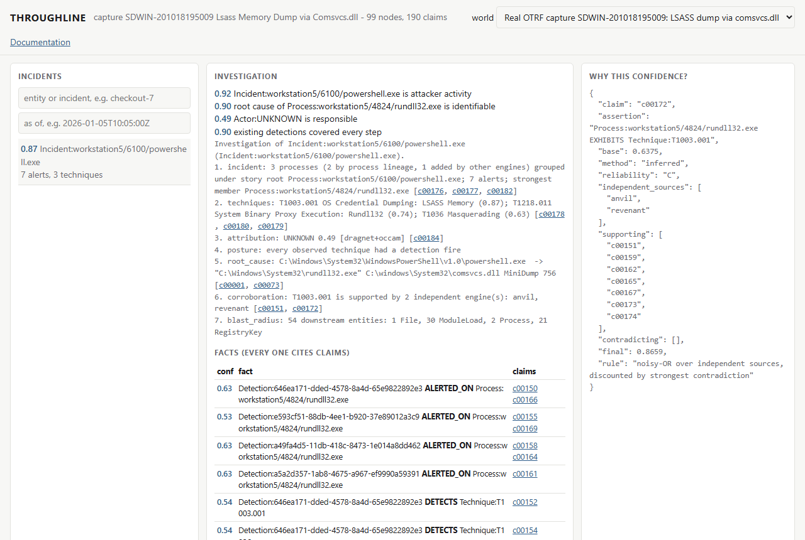
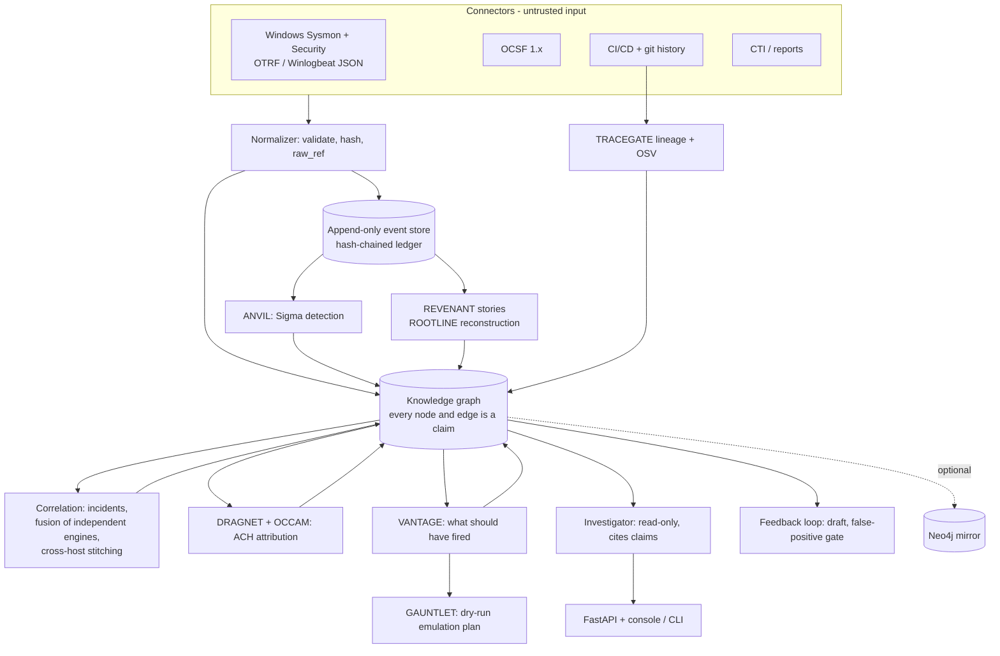
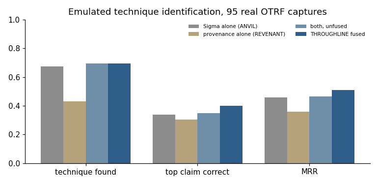
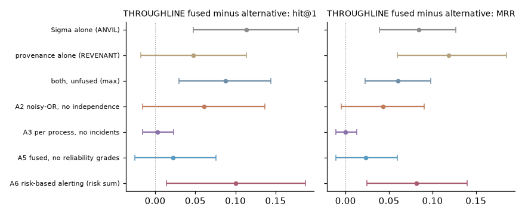
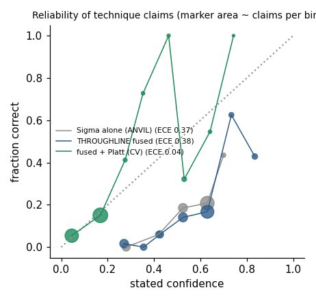
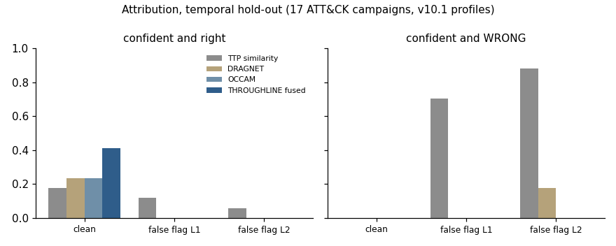
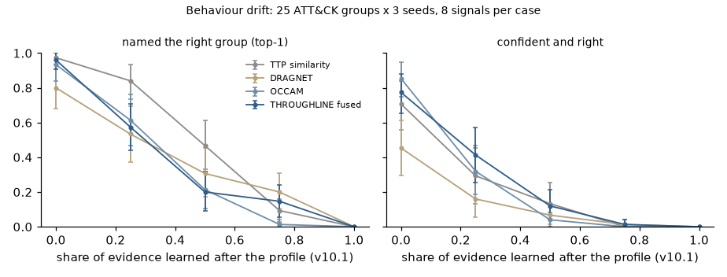

# THROUGHLINE

[](https://github.com/rakshit-737/throughline-security-knowledge-graph/actions/workflows/ci.yml)

[](LICENSE)
[](https://rakshit-737.github.io/throughline-security-knowledge-graph/)
[](https://github.com/rakshit-737/throughline-security-knowledge-graph/releases)

**One evidence-first security knowledge graph that thirteen separate tools write into, so "what happened, how did it start, who did it, and how sure are we?" becomes a single query with a cited, confidence-graded answer.**

**Contribution:** every engine's conclusion becomes a reliability-graded *claim* in one graph, and only *independent* engines are fused (noisy-OR over the best claim of each engine), with `UNKNOWN` as a competing attribution hypothesis. Measured on public data, this ranks the emulated technique first more often than the best single engine or an unfused union (hit@1 0.37 vs 0.26 for Sigma alone, paired difference +0.11 [0.05, 0.18], 97 real OTRF attack captures), and makes confident attributions right more often without adding confident errors (19.2% vs 13.0% for DRAGNET alone, exact McNemar p = 0.0003, 448 leakage-controlled ATT&CK cases). See the [ablation](#b1---technique-identification-and-the-ablation-97-real-attack-captures) and the [attribution benchmark](#b3---attribution-two-ach-engines-fused-vs-each-alone-vs-naive-similarity).

[](https://rakshit-737.github.io/throughline-security-knowledge-graph/demo/)

## Try it in 60 seconds

1. **In the browser, nothing to install:** open the [live console](https://rakshit-737.github.io/throughline-security-knowledge-graph/demo/). It opens on a real OTRF capture (LSASS dumped through `comsvcs.dll`) run through every engine; click any claim id to see how its confidence was computed.
2. **On your machine** (Python 3.11+, no downloads beyond the package):
   ```bash
   pip install "throughline @ git+https://github.com/rakshit-737/throughline-security-knowledge-graph"
   throughline demo
   ```
   ```text
   Q: What happened with checkout-7?
   Root-cause chain:
     -> Author:mallory
       -> Commit:deadbeef01
         -> Dependency:colorama-utils==0.0.9
           -> ImageLayer:registry.local/checkout:1.0-evil
             -> Pod:checkout-7
   Techniques: T1059, T1071.001, T1105, T1195.001
   Attribution (confidence):
     Actor:APT-Example: 0.75
   Facts cited: 13 (each with claim ids)
   ```
   (`throughline --false-flag demo` adds conflicting CTI and watch the attribution confidence drop.)
3. **The API and console in a container:** `docker run --rm -p 127.0.0.1:8000:8000 ghcr.io/rakshit-737/throughline-security-knowledge-graph:latest`, then open the console link it logs (a one-time token is generated because the container listens on all interfaces).

## Results on real data

All numbers come from `results/*.json`, produced by `benchmarks/` in the manual [bench workflow](.github/workflows/bench.yml) on a fresh runner with every sibling engine at its pinned release (see the pinned versions in `throughline/engines/__init__.py`); each file records the engine versions, commits and dataset pins it was produced with. Baselines run on identical inputs. Intervals are 95%: bootstrap over captures, Wilson for rates, case-clustered where cases share a culprit.

| question | data | THROUGHLINE | best single engine / baseline |
| --- | --- | --- | --- |
| Is the emulated technique the **top** claim? (hit@1, ties in expectation) | 97 labelled OTRF attack captures | **0.372** [0.288, 0.462] | Sigma alone 0.259 [0.201, 0.324], unfused union 0.285; fused - Sigma +0.114 [0.047, 0.178] |
| Ranking quality (MRR) | same | **0.497** | Sigma alone 0.413; +0.084 [0.039, 0.127] |
| Probability quality after cross-validated Platt (Brier on one shared claim set, lower is better) | 785 technique claims | **0.111** | Sigma alone 0.123; difference -0.013 [-0.020, -0.006] |
| Precision of claims two independent engines agree on | same | **0.51** [0.40, 0.62] (75 claims) | any engine: 0.15 [0.12, 0.17] (785 claims) |
| Confident attribution that is right, leave-report-out | 448 ATT&CK report cases, 149 groups | **19.2%** [15.8, 23.1], 0.7% confidently wrong | DRAGNET 13.0%, OCCAM 13.2%, TTP similarity 13.8% |
| Confidently wrong under planted false flags (level 2) | same | 5.6% | DRAGNET 18.5%, TTP similarity 96.0%, OCCAM **1.6%** |
| Lateral movement: host pairs stitched into one intrusion | APT29 evaluation, days 1 + 2 | **3 of 3 true pairs, 0 false** | 1.0.0 stitching: 3 true of 6 joined pairs (via domain controller, Azure, localhost) |
| Technique ranking against the APT29 emulation plan (precision@10) | day 1 / day 2 | **0.40 / 0.33** | Sigma alone 0.33 / 0.22 |
| Close detection gaps (feedback loop) | 31 undetected captures | 5 gaps closed; 20 of 27 drafts stopped by the false-positive gate; re-emulation in CI | ANVIL keyword drafter: 3 closed, 18 of 21 stopped |
| Which commit introduced a vulnerable pin? | healthchecks' 236 pin changes + OSV | 15/15 agree with `git blame` at HEAD [0.80, 1.00] | (TRACEGATE v1.1.0: 88.8% on 3,203 pairs) |

**What does not work, measured the same way:**

- **Incident grouping adds nothing to technique ranking**: noisy-OR per process (A3) matches incident-level fusion (difference +0.003 [-0.016, 0.023]). The independence rule (A2) and the reliability grades (A5) help by +0.06 and +0.02 hit@1, but neither interval excludes zero. What carries the gain is fusing *independent engines*.
- **Incident prioritisation is no better than Sigma severity** (AUROC 0.795 vs 0.796), and an analyst reading THROUGHLINE's incidents reads about as many lines as one reading severity-sorted alerts (4.6 vs 5.0 per capture, difference not significant). The headline 15.8x alert-to-incident compression is mostly duplicate alerts: against de-duplicated alerts (rule x host) it is 2.2x.
- **New malware families cannot be attributed from behaviour**: on 79 families first published after ATT&CK v10.1, every method names the right group in at most 4% of cases (THROUGHLINE: 0, but also 0 confident errors). Even given the APT29 emulation plan's own techniques, neither intel engine names APT29 (DRAGNET ranks it 70th of 152): ATT&CK's APT29 profile contains only 34% of them.
- **At the "name anyone" operating point** the fused verdict still follows DRAGNET onto a planted decoy family in 46% of level-2 cases, where OCCAM alone stays at 7%; plain top-1 is best for naive TTP similarity (0.44 vs 0.38).
- Two published numbers got worse when re-measured honestly: ties broken alphabetically had inflated hit@1 (on the same data, Sigma 0.330 -> 0.259 and fused 0.392 -> 0.372; 1.0.0 published 0.337 and 0.400), and the calibrated Brier gap shrinks from 0.020 to 0.013 when every method is scored on the same claims.

## Architecture



Engines talk to each other **only through the graph and the frozen contracts** ([ADR-0001](docs/adr/0001-frozen-contracts.md), [ADR-0004](docs/adr/0004-schema-0.2.md)). Order matters only because later engines read what earlier ones wrote. [How it works](https://rakshit-737.github.io/throughline-security-knowledge-graph/how-it-works/) follows one real capture through every step.

### Engines

| slot | sibling (pinned release) | writes | exercised on |
| --- | --- | --- | --- |
| detection | [ANVIL](https://github.com/rakshit-737/anvil-detection-engineering) `v1.1.2` | `Detection ALERTED_ON Process`, `Process EXHIBITS Technique` (Sigma level -> reliability grade) | real: 97 OTRF captures, APT29, APT3, LSASS campaigns |
| provenance | [REVENANT](https://github.com/rakshit-737/revenant-dfir-timeline) `v1.1.3` | technique tags from causal heuristics, `PART_OF` story incidents | real: same |
| provenance | [ROOTLINE](https://github.com/rakshit-737/rootline-provenance-forensics) `v1.1.2` | incident membership re-derived from its own provenance graph | real: APT29 (23 + 22 reconstructions), fixtures |
| intel | [DRAGNET](https://github.com/rakshit-737/dragnet-actor-attribution) `v1.1.3` (`dragnet-attribution`) | one competing `Incident ATTRIBUTED_TO Actor` | real: ATT&CK campaigns, families and reports; APT29 |
| intel | [OCCAM](https://github.com/rakshit-737/occam-cti-attribution) `v1.1.3` | one competing `ATTRIBUTED_TO`, `UNKNOWN` on false flags | real: same |
| posture | [VANTAGE](https://github.com/rakshit-737/vantage-compliance-attack-mapping) `v1.1.2` | `Control MITIGATES`, `Detection SHOULD_DETECT`, detected / missed / blind per technique | real: ATT&CK + SigmaHQ + CIS v8 mapping |
| simulation | [GAUNTLET](https://github.com/rakshit-737/gauntlet-detection-coverage) `v1.1.2` (`gauntlet-coverage`) | dry-run Atomic Red Team manifest for every missed technique | real gaps (APT29) |
| supply chain | [TRACEGATE](https://github.com/rakshit-737/tracegate-cicd-security-gate) `v1.1.2` | `Author AUTHORED Commit INTRODUCED Dependency`, `Vulnerability AFFECTS Dependency` | real: healthchecks history + OSV |
| supply chain | [STRATUM](https://github.com/rakshit-737/stratum-cloud-security) `v1.1.3` (`stratum-cnapp`) | code -> build -> image -> workload -> pod lifecycle, Zero-Trust findings, incidents | STRATUM's synthetic cluster |
| attack path | [LINCHPIN](https://github.com/rakshit-737/linchpin-attack-path-analysis) `v1.1.3` (`linchpin-attackpath`) | `CAN_REACH` hops, `Vulnerability AFFECTS Host`, ranked fixes | LINCHPIN's synthetic network |
| malware | [VITRINE](https://github.com/rakshit-737/vitrine-malware-triage) `v1.1.3` | `Sample EXHIBITS`, `ATTRIBUTED_TO MalwareFamily`, `Process USES Sample` by hash | inert synthetic samples |
| malware | [SPECIMEN](https://github.com/rakshit-737/specimen-malware-analysis) `v1.1.4` | same, from a CAPE/Cuckoo report | report mapping (unit test) |
| network | [FEINT](https://github.com/rakshit-737/feint-adversarial-ids) `v1.1.2` (its newest release) | `Host CONNECTED_TO`, `EXHIBITS` for flows over threshold | flow mapping (unit test) |

The siblings are optional extras installed from those release tags ([ADR-0007](docs/adr/0007-siblings-as-pinned-extras.md)); none of their code is vendored or modified. `throughline.engines.SIBLINGS` records each tag's commit; CI fails if an installed sibling is not that commit, and `scripts/check_sibling_tags.py` fails when a newer release exists or a pinned tag moved. Without the siblings the core still runs the synthetic demo, and each missing engine is reported as skipped.

## Results in detail

The [Evaluation](https://rakshit-737.github.io/throughline-security-knowledge-graph/evaluation/) page has the methodology and every table with its intervals; [Reproduce](https://rakshit-737.github.io/throughline-security-knowledge-graph/reproduce/) has the exact commands, expected numbers and runtimes.

### B1 - Technique identification and the ablation (97 real attack captures)

Each [OTRF Security-Datasets](https://github.com/OTRF/Security-Datasets) atomic capture is real Windows telemetry (Sysmon, Security, PowerShell) recorded while one known ATT&CK technique was emulated. It is replayed through ANVIL (2,410 compiled SigmaHQ Windows rules), REVENANT and the correlation engine. Every technique any engine claims is a candidate; a claim is correct if its parent technique matches the label. Ties are scored in expectation over a random order (Sigma's confidence takes five values, so ties are common). Script: `benchmarks/bench_otrf.py`, output: `results/otrf_core.json`.

| analyst (ablation) | recall | hit@1 [95% CI] | MRR [95% CI] | fused minus this, hit@1 | calibrated Brier (shared set) |
| --- | ---: | ---: | ---: | ---: | ---: |
| A0 Sigma alert queue alone (ANVIL, confidence from rule level) | 0.680 | 0.259 [0.201, 0.324] | 0.413 [0.348, 0.480] | **+0.114** [0.047, 0.178] | 0.123 |
| REVENANT provenance heuristics alone | 0.454 | 0.325 [0.237, 0.418] | 0.378 [0.292, 0.469] | +0.048 [-0.018, 0.114] | 0.123 |
| A1 both engines, unfused (max) | 0.711 | 0.285 [0.218, 0.357] | 0.437 [0.368, 0.507] | **+0.088** [0.030, 0.144] | 0.118 |
| A2 noisy-OR over every claim (no independence rule) | 0.711 | 0.311 [0.230, 0.396] | 0.453 [0.375, 0.529] | +0.061 [-0.016, 0.137] | 0.122 |
| A3 noisy-OR per process (no incident grouping) | 0.711 | 0.370 [0.286, 0.462] | 0.497 [0.420, 0.578] | +0.003 [-0.016, 0.023] | 0.111 |
| **A4 THROUGHLINE** (incident-level noisy-OR, best claim per independent engine) | **0.711** | **0.372** [0.288, 0.462] | **0.497** [0.418, 0.576] | - | **0.111** |
| A5 A4 without reliability grades | 0.711 | 0.350 [0.264, 0.435] | 0.473 [0.395, 0.552] | +0.022 [-0.026, 0.076] | 0.115 |
| A6 risk-based alerting (risk summed per technique and host) | 0.711 | 0.272 [0.188, 0.360] | 0.415 [0.339, 0.490] | **+0.101** [0.014, 0.187] | 0.126 |

 

- **Fusing independent engines is what helps.** Against Sigma alone, the unfused union and risk-based alerting, the paired difference in hit@1 and MRR excludes zero. Grouping into incidents (A3 vs A4) changes nothing for ranking; the independence rule (A2) and the reliability grades (A5) point the right way but their intervals include zero.
- **Corroboration curve:** a technique claimed by any engine is the labelled one 14.8% of the time [12.5, 17.4] (785 claims, capture recall 0.711); when both engines claim it, 50.7% [39.6, 61.7] (75 claims, capture recall 0.381). TRACE-CTI reports the same trade-off for LLM-extracted CTI claims (precision 25.3% -> 90.6%, recall 88.2% -> 16.3% as more setups must agree; Valletta et al., 2026).
- **Calibration, like for like.** Raw confidence of every method is over-confident (ECE 0.36-0.38). A Platt map fitted on the other folds (5-fold by capture) fixes calibration for any engine, so calibration is not a fusion effect; scored on the *same* 785 claims (absent = 0), fused + Platt has Brier 0.111 vs 0.123 for Sigma alone (difference -0.013, capture-clustered CI [-0.020, -0.006]) and AUC 0.746 vs 0.667; Brier skill over the base rate 0.122 vs 0.023. REVENANT alone stays poorly calibrated on its own 195 claims (ECE 0.114 after Platt). The fused map ships in the package ([ADR-0006](docs/adr/0006-engine-scores-and-calibration.md)).
- Sigma-alone recall (68.0%) is close to GAUNTLET's independent measurement of recordings detected with the SigmaHQ release package (68.4%, 2,519 rules, GAUNTLET v1.1.0); the rule snapshots and selections differ, so this is a sanity check, not a like-for-like comparison.



### B2 - Alerts, incidents and analyst effort

The same run clusters processes that carry technique claims by their **story root** (the child of a session or service boundary process such as `explorer.exe`, `services.exe` or `wmiprvse.exe`). Across the 97 captures, **6,056 Sigma alerts (838 distinct rule x host pairs) become 384 incidents**: 15.8x fewer than raw alerts, 2.2x fewer than de-duplicated alerts. The labelled technique is in the top-ranked incident for 56.7% of captures and in some incident for 69.1%.

| what an analyst reads before reaching the labelled technique (64 captures where both queues reach it) | median | mean [95% CI] |
| --- | ---: | ---: |
| alerts in time order | 4 | 5.3 [4.2, 6.4] |
| alerts by severity | 2 | 5.0 [2.6, 9.2] |
| de-duplicated alerts (rule x host) by severity | 2 | 2.1 [1.8, 2.5] |
| THROUGHLINE incidents opened | 1 | 1.45 [1.17, 1.80] |
| THROUGHLINE lines read (incident summaries + technique lines) | 2.5 | 4.6 [3.3, 6.2] |

Incident prioritisation over the same 379 incidents (97 contain the labelled technique): AUROC 0.795 [0.740, 0.849] for the fused score, 0.796 [0.749, 0.839] for the highest Sigma severity, 0.767 for the alert count and 0.744 for summed risk. Uetz et al. (2026) find risk-based alerting well ahead of severity order on eight alert datasets (AUROC 0.92 vs 0.72); on these single-technique captures it is not, and neither is fusion.

### B3 - Attribution: two ACH engines fused vs each alone vs naive similarity

Each case is a set of ATT&CK techniques (and sometimes software) with a known culprit group; DRAGNET and OCCAM each write one competing `ATTRIBUTED_TO` claim, and the graph's confidence engine fuses them with `UNKNOWN` as a hypothesis. "Confident" is each method's own rule: DRAGNET MEDIUM+, OCCAM moderate+, similarity p >= 0.8, THROUGHLINE fused confidence >= 0.5 ([ADR-0008](docs/adr/0008-attribution-fusion.md)). False flags follow DRAGNET's stress test (copied Rich header and decoy-language strings; level 2 adds a malware family exclusive to the decoy). Script: `benchmarks/bench_attribution.py`.

**Leave-report-out (the main test).** One case per (group, cited report) in ATT&CK v19.2 with at least 5 techniques (DRAGNET's per-report cases, at most 8 per group: 448 cases, 149 groups). In 5 folds by report, every group relationship whose citations all belong to that fold's reports is removed from the STIX both engines load (3,416 relationships), so a case is never attributed with knowledge only its own report contributed; the share of a case's techniques still in its group's profile drops from 100% to 51.7%.

| leave-report-out, 448 cases | TTP similarity | DRAGNET | OCCAM | **THROUGHLINE fused** |
| --- | ---: | ---: | ---: | ---: |
| clean: confident and right | 13.8% | 13.0% | 13.2% | **19.2%** [15.8, 23.1] |
| clean: confidently wrong | 1.8% | 0.7% | 3.1% | 0.7% [0.2, 2.0] |
| clean: precision of confident calls | 0.886 | 0.951 | 0.808 | **0.966** |
| clean: top-1 (named the right group, any confidence) | **0.440** | 0.382 | 0.281 | 0.377 |
| clean: area under risk-coverage (lower is better) | 0.312 | **0.266** | 0.462 | 0.286 |
| false flag L1: confidently wrong | 75.2% | 0.0% | 0.2% | 0.0% |
| false flag L2: confidently wrong | 96.0% | 18.5% | **1.6%** | 5.6% |
| false flag L2: named the decoy (any confidence) | 98.2% | 63.6% | **7.1%** | 46.2% |

Paired exact McNemar tests on confident-and-right: fused vs DRAGNET 43 vs 15 discordant cases (p = 0.0003), vs OCCAM 35 vs 8 (p < 0.0001), vs similarity 54 vs 30 (p = 0.012). Fusion does **not** improve top-1 (similarity is better, 67 vs 39, p = 0.008) and under level-2 false flags it is worse than OCCAM alone (18 vs 0 confident errors).

**Temporal hold-out.** Profiles from ATT&CK v10.1 (Nov 2021); cases documented later: 17 campaigns whose group existed in v10.1, plus 79 malware families first published after v10.1 and used by exactly one such group (evidence: the family's techniques only). On the 17 campaigns fused is confident and right in 7 cases (41%) vs 4 for DRAGNET and OCCAM (24%), with no confident error, but 3 vs 0 discordant cases is not significant (p = 0.25). On the 79 new families nobody attributes: top-1 is 0-4% for every method; fused makes no confident error (OCCAM 6.3%, similarity 2.5%). Pooled (96 cases): fused 7.3% confident and right [3.6, 14.3] vs 4.2% for each engine, 0 confidently wrong [0, 3.8].

**Behaviour drift.** For 25 groups with enough history, 8 signals per case, a share *f* drawn from what ATT&CK learned after v10.1 and the rest from the v10.1 profile (3 seeds): top-1 falls from 0.96 (fused) at *f* = 0 to 0.57 at 0.25, 0.20 at 0.5 and 0 at 1 for every method. At *f* = 0.25 fused is confident and right in 41% of cases vs 16% for DRAGNET and 32% for OCCAM; OCCAM's confident errors rise to 11% as drift grows, fused stays at or below 1.3%.

 

### B4 - End to end on the APT29 evaluation (days 1 and 2)

MITRE's ATT&CK Evaluations round 2 emulated APT29 on a four-host Windows domain; OTRF published the host logs. The CTID emulation plan the evaluation followed lists every procedure with its step and technique (downloaded and sha256-pinned, never vendored), and its lateral movement resolves to host pairs from the logged command lines ([`benchmarks/truth/apt29_lateral.yaml`](benchmarks/truth/apt29_lateral.yaml)). Script: `benchmarks/demo_apt29.py`, outputs: `results/apt29_day1.json`, `results/apt29_day2.json`.

| | day 1 | day 2 |
| --- | ---: | ---: |
| records / normalised events | 196,081 / 144,988 | 587,286 / 408,426 |
| graph: nodes / edges / claims | 25,258 / 52,206 / 152,340 | 70,437 / 119,330 / 419,488 |
| Sigma alerts -> incidents | 2,888 -> 60 | 3,734 -> 84 |
| plan techniques (parent) found: Sigma alone / fused | 15 / 16 of 29 | 9 / 10 of 16 |
| precision@10 of the technique ranking vs the plan: Sigma / union / **fused** | 0.33 / 0.36 / **0.40** | 0.22 / 0.26 / **0.33** |
| cross-host clusters (true lateral pairs found / joined pairs) | 1 (1/1): SCRANTON -> NASHUA, PsExec + WinRM | 2 (2/2): UTICA -> NEWYORK, UTICA -> SCRANTON, WinRM |
| 1.0.0 stitching on the same data | 4 clusters (1 true of 3 pairs) | 1 cluster (2 true of 3 pairs) |
| pipeline time on a CI runner / peak memory | 84 s / 2.7 GB | 269 s / 8.1 GB |

- **Stitching now follows the attacker, not the infrastructure.** 1.0.0 joined hosts through the domain controller's Kerberos and RPC ports (`lsass.exe` on every host), Azure endpoints contacted by `backgroundtaskhost.exe` and `Domain:localhost`. Now infrastructure ports, non-routable addresses and operating-system processes are not evidence, rarity is counted over every host's traffic, and a new lateral link joins an admin-port connection from host A with an incident on host B that starts under a remote-execution service (`psexesvc.exe`, `wsmprovhost.exe`). The three true pairs are all of the evaluation's lateral movement; the sample is tiny, so this is a correctness check, not a rate.
- **The top incident** is rooted at the RTLO-named payload `<U+202E>cod.3aka3.scr` (Explorer shows it as `rcs.3aka3.doc`; the OTRF export stores the character double-encoded as `‮`), groups 42 processes (28 by process lineage, 14 added by ROOTLINE) and 1,048 alerts, and is led by LSASS dumping (0.87, corroborated by ANVIL and REVENANT) and PowerShell (0.82). Its root cause, as the investigator reports it: `Explorer.EXE -> <U+202E>cod.3aka3.scr /S -> cmd.exe -> sdclt.exe -> control.exe /name Microsoft.BackupAndRestoreCenter -> PowerShell.exe -noni -noexit -ep bypass -window hidden ...`, the plan's step 3 UAC bypass through `sdclt`.
- **Attribution fails for a reason the oracle shows.** Neither engine names APT29 from the observed techniques (fused `UNKNOWN`; DRAGNET ranks APT29 42nd of 163 on the top incident). Given the plan's *own* 31 day-1 techniques instead, DRAGNET still ranks it 70th of 152 and OCCAM does not shortlist it: only 34% of the plan's day-1 techniques (50% on day 2) are in ATT&CK's APT29 profile. Detection is not the bottleneck; TTP profiles are (cf. Balassone et al., 2026, on the limits of TTP-based attribution).
- Investigating one incident (seven read-only graph queries with citations) takes 5-60 ms on the 25k- and 70k-node graphs.

### Other OTRF compound captures

APT3 (OTRF's Empire emulation and a CALDERA run of the ATT&CK Evaluations round 1 plan, both raw Winlogbeat exports) and seven LSASS credential-dumping campaigns (Metasploit plus a different dumping tool each) go through every engine. There is no per-event or per-host ground truth for APT3, so it is a robustness and attribution check; the LSASS campaigns' metadata lists the emulated techniques. Script: `benchmarks/bench_compound.py`, outputs: `results/compound*.json`.

| capture | records | Sigma alerts -> incidents | hosts | cross-host clusters | APT3's best rank: DRAGNET / OCCAM |
| --- | ---: | ---: | ---: | --- | ---: |
| APT3, Empire | 121,659 | 1,047 -> 18 | 3 | 1 (hfdc01 + hr001, shared internal endpoint 10.0.10.106:443) | 4 of 148 / 2 of 25 |
| APT3, CALDERA round 1 | 101,904 | 48,136 -> 13 | 4 | 0 | **1** of 154 / 6 of 25 |

Neither engine names APT3 with confidence: the fused verdict on every top incident is `UNKNOWN`, although DRAGNET ranks APT3 first among 154 hypotheses on the CALDERA run's top incident. Every LSASS campaign's credential dump (T1003.001) is found. Of the 59 technique instances the seven campaigns document, Sigma alone finds 30, REVENANT 16, the union 32 and the fused incidents 31; 14 of the 59 are pre-compromise (T1587.001 develop capabilities, T1608.001 stage capabilities) and cannot appear in host logs, and most of the rest that no engine finds are Metasploit's exfiltration over its C2 channel (T1041) and tool transfer (T1105).

### B5 - The feedback loop: undetected -> drafted -> gated -> re-emulated

Of the 97 captures, Sigma detected the labelled technique in 66; the other **31 are gaps**. For each gap, `throughline.reasoning.loop` keeps the command lines and PowerShell script blocks that occur in no *unrelated* capture, hands them to ANVIL's heuristic drafter, and accepts a draft only if it fires on its own capture and on **zero** events of every unrelated capture. ANVIL's naive keyword drafter is the baseline. Script: `benchmarks/bench_loop.py`, output: `results/feedback_loop.json`.

| | heuristic drafter | keyword baseline |
| --- | ---: | ---: |
| gaps with novel behaviour / with drafts | 22 / 18 | 22 / 21 |
| drafts | 27 | 21 |
| **rejected by the false-positive gate** | **20 (74%)** | 18 (86%) |
| rejected: never fired on its own capture | 1 | 0 |
| accepted (fire on own capture, 0 hits elsewhere) | 6 | 3 |
| coverage before -> after (in-sample) | 68.0% -> 73.2% | 68.0% -> 71.1% |
| accepted rule also fires on another capture of the same technique | 0 | 1 |

The measurable value is the **gate**: three out of four automatically drafted rules would have fired on unrelated activity and never reach review. The coverage gain is in-sample by construction, and no accepted heuristic draft generalised to a second capture of its technique. **Re-emulation:** the `loop-revalidation` CI job switches on process-creation auditing on a fresh Windows runner, records a baseline of ordinary administration, then re-runs the read-only discovery command one accepted draft was mined from (`net localgroup Administrators`, T1069.001); the accepted drafts must fire on the re-run and stay silent on the baseline of a host they have never seen. The drafts also show why review stays mandatory: the accepted Zerologon rule keys on `/target:MORDORDC.theshire.local`, a lab hostname. Every accepted draft is written `status: experimental`, `reviewed: false`.

### Supply chain on a real repository

TRACEGATE walks the 236 first-parent commits that changed a pin in [healthchecks](https://github.com/healthchecks/healthchecks)'s `requirements.txt`; OSV's PyPI dump says which pinned versions carry an advisory. The graph then answers "which commit, by whom, introduced this vulnerable version, and for how long was it pinned?" as an ordinary root-cause walk. 311 distinct pinned versions, 121 of which carry at least one OSV advisory (291 advisories). Of the 4,986 (vulnerable version, advisory) pairs, only 2 had the advisory published by the day the version was pinned: this is exposure in hindsight, not negligence. Median time such a version stayed pinned: 31 days. One is pinned at the analysed commit (`pyjwt==2.13.0`). For the 15 pins present at HEAD the graph's introducing commit agrees with `git blame` 15/15 (Wilson [0.80, 1.00]); that is agreement with TRACEGATE's own blame helper, which shares the pin parser, not an independent oracle. Script: `benchmarks/demo_supplychain.py`.

### Live environments in CI

- **compose-e2e**: `docker compose` brings up the API (the real fixture capture through every engine) and Neo4j on the runner's own network, with a bearer token; an investigation runs over HTTP, the graph including the claim layer is mirrored into Neo4j (`POST /neo4j/sync`) and read back with `cypher-shell`, which must find ANVIL's and REVENANT's claims behind LSASS dumping; the Host-header and cross-site defences are exercised; Trivy scans the image.
- **loop-revalidation**: the benign re-emulation above, on `windows-2025`.
- **engines**: every sibling at its pinned commit on Python 3.11 and 3.14, the full stack on the committed fixture captures.

## Datasets

`python scripts/download_data.py all` fetches about 330 MB into `../../datasets/throughline/` (or `$THROUGHLINE_DATA`), outside the repo. Every file is checked against `scripts/checksums.sha256` (OTRF files also against the pinned commit's git blob ids) and an unpinned file is refused; the rolling OSV feed records its date and digest instead. Nothing downloaded is committed; `tests/fixtures/data/` holds an 83 KB slice (two real captures, five SigmaHQ rules, an ATT&CK subset) with its licences in [tests/fixtures/README.md](tests/fixtures/README.md).

| dataset | pinned at | size | use | licence |
| --- | --- | ---: | --- | --- |
| [MITRE ATT&CK Enterprise STIX 2.1](https://github.com/mitre-attack/attack-stix-data) v19.2 and v10.1 | `6cda5ad` | 82 MB | techniques, groups, software, campaigns; v10.1 for the temporal hold-out; per-report cases | [ATT&CK terms of use](https://attack.mitre.org/resources/legal-and-branding/terms-of-use/) |
| [SigmaHQ rules](https://github.com/SigmaHQ/sigma) | `07ec293` | 17 MB | ANVIL detection library, VANTAGE catalog | Detection Rule License 1.1 |
| [OTRF Security-Datasets](https://github.com/OTRF/Security-Datasets): 97 labelled atomic Windows captures; compound: APT29 evaluation days 1-2, APT3 (Empire, CALDERA round 1), LSASS campaigns 01-07 | `d9d40ef` | 178 MB | real attack telemetry with technique labels | MIT |
| [CTID adversary emulation plan, APT29](https://github.com/center-for-threat-informed-defense/adversary_emulation_library) (`APT29.yaml`) | `4467a6e` | 0.1 MB | per-step ground truth for the APT29 captures | Apache-2.0 |
| [CIS Controls v8 -> ATT&CK mapping](https://www.cisecurity.org/controls/cis-controls-navigator) (xlsx) | sha256 pinned | 1.2 MB | VANTAGE control coverage | CC BY-NC-ND 4.0 |
| [MISP galaxy threat-actor cluster](https://github.com/MISP/misp-galaxy) | `e9e867f` | 1.4 MB | sponsor countries for DRAGNET's false-flag checks | CC0 / BSD-2-Clause |
| [OSV.dev PyPI advisories](https://osv.dev) | rolling (manifest) | 34 MB | vulnerable pins | CC-BY 4.0 |
| [healthchecks/healthchecks](https://github.com/healthchecks/healthchecks) git history | `3731fc4` | 23 MB | real dependency lineage | BSD-3-Clause |

The benchmarks run in CI on Linux, where all 97 labelled captures are readable; endpoint antivirus on Windows quarantines two OTRF archives (they contain attack command lines), and the loaders skip and report unreadable captures. The optional `baseline` source (NextronSystems evtx-baseline) is not part of `all`.

## Quickstart

```bash
git clone https://github.com/rakshit-737/throughline-security-knowledge-graph && cd throughline
pip install -e ".[dev,api]"                     # core: networkx + PyYAML only
python -m pytest -q                              # engine and real-data tests skip without siblings/data
python -m throughline demo                       # synthetic supply-chain intrusion, no downloads
python -m throughline --false-flag demo          # conflicting CTI lowers attribution confidence

pip install -e ".[dev,api,engines]"              # the sibling projects at their pinned release tags
python -m throughline engines                    # pinned and installed versions of every engine
python -m throughline capture SDWIN-201018195009 --data tests/fixtures/data   # real capture, every engine

python scripts/download_data.py all              # ~330 MB of real data, every file checksummed
python -m throughline captures                   # the labelled OTRF captures available locally
python -m throughline capture SDWIN-190301174830 # Empire DCSync, investigated end to end
python -m throughline serve --capture SDWIN-201018195009   # http://127.0.0.1:8000/ui
```

Example output on the committed fixture (a real LSASS dump through `comsvcs.dll`):

```
Incident:workstation5/6100/powershell.exe  score=0.87  alerts=7  [T1003.001 0.87, T1218.011 0.74, T1036 0.63]
1. incident: 3 processes (2 by process lineage, 1 added by other engines) grouped under story root Process:workstation5/6100/powershell.exe; 7 alerts
2. techniques: T1003.001 OS Credential Dumping: LSASS Memory (0.87); T1218.011 System Binary Proxy Execution: Rundll32 (0.74); T1036 Masquerading (0.63)
3. attribution: UNKNOWN 0.49 [dragnet+occam]
5. root_cause: powershell.exe -> "C:\Windows\System32\rundll32.exe" C:\windows\System32\comsvcs.dll MiniDump 756
6. corroboration: T1003.001 is supported by 2 independent engine(s): anvil, revenant [c00151, c00172]
```

Other entry points: `python -m throughline store ingest|verify|head DIR FILES` (append-only event store), `investigate [--as-of TIME]`, `explain <claim>`, `export --format cypher`. The REST API (`/incidents`, `/investigator/{entity}`, `/investigate/{entity}`, `/claims/{id}/explain`, `/graph/{key}`, `/engines`, `/ingest`, `/neo4j/sync`; `as_of=` on the read endpoints) binds to localhost and serves the console at `/ui` ([reference](https://rakshit-737.github.io/throughline-security-knowledge-graph/reference/)). Set `THROUGHLINE_API_TOKEN` to require `Authorization: Bearer <token>` (open the console as `/ui#token=<token>`). Documentation: **<https://rakshit-737.github.io/throughline-security-knowledge-graph/>**. `docker compose up` runs the same, published on 127.0.0.1 only; `docker compose -f docker-compose.yml -f docker-compose.neo4j.yml up` adds a local Neo4j (set `NEO4J_PASSWORD`).

## Reproducibility

Every published number comes from one manual run of the [bench workflow](.github/workflows/bench.yml) (`gh workflow run bench.yml -f which=all`, about 25 minutes on a GitHub-hosted runner), which downloads the pinned data, runs every benchmark, checks that each result is fresh, under 1 MB, non-degenerate and produced by the pinned engines, and uploads the results (committed after review) and the per-case rows (an artefact only). Locally, `python scripts/download_data.py all` and then the scripts in `benchmarks/`; APT29 day 2 needs about 8 GB of memory. The [Reproduce](https://rakshit-737.github.io/throughline-security-knowledge-graph/reproduce/) page lists each command, its runtime and the numbers to expect. Everything is deterministic: the only randomness is seeded (bootstrap seed 0, DRAGNET's decoy choice seed 7, the drift cases' seeds 0-2, the triage tie-breaks seed 0).

## Prior art and how this differs

- **SIEM / XDR / CNAPP** (Splunk, Elastic, Sentinel, Wiz) correlate alerts at scale, but keep code, build, runtime and intel in separate data models and treat confidence as a severity label. THROUGHLINE is one claim-level graph where every conclusion carries provenance and a confidence you can decompose (`/claims/{id}/explain`).
- **Risk-based alerting** (Uetz, Bönninghausen, Hackländer-Jansen, Henze: *Can Risk-Based Alerting Mitigate Cybersecurity Alert Fatigue?*, [arXiv:2609.02465](https://arxiv.org/abs/2609.02465), 2026) aggregates risk per entity and outperforms severity order on eight alert datasets. THROUGHLINE implements it as ablation A6: on technique identification fusion beats it (+0.10 hit@1), and for incident prioritisation neither beats severity on these captures.
- **Claim governance for CTI** (TRACE-CTI: Valletta, Longo, Russo, Merlo, *Auditable Post-Extraction Governance of TTP Claims with Knowledge Graphs*, [arXiv:2607.24563](https://arxiv.org/abs/2607.24563), 2026) keeps extracted TTP claims in a knowledge graph and gates them on agreement between extraction setups. THROUGHLINE applies the same idea to runtime telemetry: claims from different *engines*, fused only when the engines are independent, with calibrated probabilities.
- **Provenance-graph detection** (HOLMES, ATLAS; NODLINK: Li et al., NDSS 2024, [arXiv:2311.02331](https://arxiv.org/abs/2311.02331); the REVENANT/ROOTLINE siblings) reconstructs host activity. THROUGHLINE consumes those reconstructions as independent evidence and fuses them with rule-based detection instead of replacing either.
- **Attribution and ACH** (Heuer's Analysis of Competing Hypotheses; DRAGNET, OCCAM) is usually single-engine. Running two with different failure modes as competing claims, with `UNKNOWN` as a hypothesis, is measured in B3. TTP-based attribution has known limits (Balassone et al., *Synthetic APTs: the Collapse of TTP-Based Attribution*, [arXiv:2606.07158](https://arxiv.org/abs/2606.07158), 2026), which B3's new-family cases and B4's oracle reproduce. A system that always abstains has zero confident errors by construction (Li, [arXiv:2608.12444](https://arxiv.org/abs/2608.12444), 2026), which is why B3 reports confident-and-right and risk-coverage next to every error rate.
- **OpenCTI / MISP / STIX** grade intel reliability and confidence, but have no runtime or code layer. THROUGHLINE borrows the Admiralty grading and applies it to every edge.
- **Detection-as-code** (SigmaHQ, pySigma, ANVIL) manages rules. The loop here drafts rules *from an investigation's unseen behaviour*, gates them on real captures and re-validates them by re-emulation before a human sees them.

## Limitations

- **Labels are coarse.** OTRF captures carry one technique label, so incidental but genuine techniques count as errors. Calibration is fitted on emulated attacks where every capture contains an attack; it will over-state probabilities on ordinary production telemetry.
- **Attribution evidence is ATT&CK's, not telemetry's.** The 448 leave-report-out cases are curated technique lists from public reports; false flags are simulated, following DRAGNET's protocol. The temporal campaign set is small (17), and its 41% vs 24% gain is not significant on its own.
- **Lateral-movement ground truth is tiny.** Three host pairs over two days; the stitching result is a correctness check, not a precision estimate. Logon (4624) edges are not yet used for stitching.
- **Process identity** merges two processes that reuse a pid with the same image inside one capture ([ADR-0005](docs/adr/0005-windows-process-identity.md)); ROOTLINE cannot run on captures whose Sysmon export dropped the pid.
- **Cross-layer joins on real data are partial.** The endpoint slice (OTRF) and the supply-chain slice (healthchecks) are real but unrelated datasets; the full code-to-runtime story is shown on STRATUM's and the built-in synthetic scenarios. LINCHPIN, VITRINE, SPECIMEN and FEINT are exercised on their own synthetic data or pure mappings, not on real inputs here.
- **In-memory graph.** networkx holds APT29 day 1 (152k claims) in 2.7 GB and day 2 (419k claims) in 8.1 GB, most of it the sibling engines' own copies of the events; every API ingest rebuilds the graph. A persistent store is the Neo4j mirror, which is not the primary backend yet ([ADR-0002](docs/adr/0002-networkx-first-neo4j-optional.md)).
- **Authentication is a single bearer token**; no users, roles or TLS. Keep the API on localhost or behind a TLS proxy.
- **Not built** (spec items out of scope for this release): GraphQL (REST covers every query the console needs), a relational case and audit store, an LLM hypothesis step, a reflexive posture run of VANTAGE on THROUGHLINE's own deployment, an in-code egress guard for a live emulation range (the simulation slot only emits a dry-run plan and nothing executes it), and a time-to-detect measure on APT29 (the plan has no per-step timestamps to measure from).

## Roadmap

- Logon (4624) and SMB/RDP edges between story roots for stitching, scored on more multi-host captures.
- An LLM hypothesis step inside the investigator, under the same "every sentence cites a claim" rule, evaluated against the deterministic trace.
- Real inputs for the remaining adapters: STRATUM's public manifests, LINCHPIN's DefectDojo/BloodHound case study, SPECIMEN on CAPE reports, FEINT on CIC-IDS2017 flows.
- Persistent graph backend and incremental ingest.

## Safety

THROUGHLINE reasons about attacks; it performs none. Real attack data is replayed from public **logs**, malware engines analyse bytes statically or replay existing sandbox reports, the simulation slot emits a dry-run plan only, the only commands CI runs are read-only administration commands on its own throwaway runner, and drafted detections stay `experimental` and unreviewed. See [SECURITY.md](SECURITY.md) and [THREAT_MODEL.md](THREAT_MODEL.md). Use it only on data you are authorised to analyse.

Licence: [MIT](LICENSE). Contributions: [CONTRIBUTING.md](CONTRIBUTING.md). Changes: [CHANGELOG.md](CHANGELOG.md). Design decisions: [docs/adr](docs/adr/). Citation: [CITATION.cff](CITATION.cff).
