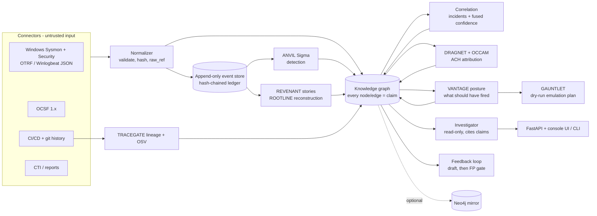

# THROUGHLINE

[](https://github.com/rakshit-737/throughline/actions/workflows/ci.yml)

[](LICENSE)

**One evidence-first security knowledge graph that thirteen separate tools write into, so "what happened, how did it start, who did it, and how sure are we?" becomes a single query with a cited, confidence-graded answer.**

Every node and edge in THROUGHLINE's graph is a *claim* with a source, a method, an Admiralty reliability grade and a confidence computed from independent corroboration and contradiction. The sibling projects of this portfolio plug in as engines that read and write only that graph: ANVIL's Sigma engine, REVENANT's and ROOTLINE's provenance reconstruction, DRAGNET's and OCCAM's ACH attribution, VANTAGE's control coverage, GAUNTLET's emulation plans, TRACEGATE's dependency lineage, and adapters for STRATUM, LINCHPIN, VITRINE, SPECIMEN and FEINT. THROUGHLINE adds the parts none of them has alone: cross-engine correlation into incidents, fused and calibrated confidence, a read-only investigator that cites every claim, and a detection feedback loop.

> Every tool here already exists separately. The point is that the answer lives in one graph, and that the graph says how sure it is.

## Results on real data

All numbers come from `results/*.json`, produced by the scripts in `benchmarks/` on public data (see [Datasets](#datasets)). Baselines run on identical inputs.

| question | data | THROUGHLINE | best single engine / baseline |
| --- | --- | --- | --- |
| Is the emulated technique the **top** claim? (hit@1) | 95 labelled OTRF attack captures | **0.400** (MRR 0.511) | Sigma alone 0.337 (MRR 0.457); paired bootstrap p = 0.013 on MRR |
| Is it claimed at all? (recall) | same | 0.695 | Sigma alone 0.674, provenance alone 0.432 |
| Probability quality after cross-validated calibration (Brier, lower is better) | 769 technique claims | **0.110** (ECE 0.036; raw fused ECE 0.379) | Sigma alone 0.130 (ECE 0.032) |
| Alert load | same | **376 incidents** | 5,994 Sigma alerts (15.9x more) |
| Confident attribution that is right, temporal hold-out | 17 ATT&CK campaigns, v10.1 profiles | **41%**, 0% confidently wrong | DRAGNET 24%, OCCAM 24%, TTP similarity 18% |
| Confidently wrong under planted false flags (level 2) | same | **0%** | TTP similarity 88%, DRAGNET 18%, OCCAM 0% |
| Close detection gaps from the investigation (feedback loop) | 31 undetected captures | 4 gaps closed; 20 of 25 drafts stopped by the false-positive gate | ANVIL keyword drafter: 3 closed, 17 of 20 stopped |
| Scale, full APT29 evaluation day 1 | 196,081 Windows events | 152,833 claims, 2,888 alerts into 60 incidents in 13 min; one investigation in 49-114 ms | - |
| Which commit introduced a vulnerable pin? | healthchecks' 236 pin changes + OSV | 15/15 agree with `git blame` at HEAD | (TRACEGATE's own benchmark: 97.5% on 365 pins) |

What does **not** work well, measured the same way: behaviour-only attribution of the real APT29 telemetry does not name APT29 (THROUGHLINE correctly refuses to name anyone with confidence); at the "name anyone" operating point the fused verdict still follows DRAGNET onto a planted decoy in 41% of level-2 false-flag cases, where OCCAM alone stays at 0%; and raw fused confidence is a good ranking score but not a probability until calibrated. Details and caveats are below.

## Architecture



Engines talk to each other **only through the graph and the frozen contracts** ([ADR-0001](docs/adr/0001-frozen-contracts.md), [ADR-0004](docs/adr/0004-schema-0.2.md)). Order matters only because later engines read what earlier ones wrote.

### Engines

| slot | sibling (pinned commit) | writes | exercised on |
| --- | --- | --- | --- |
| detection | [ANVIL](https://github.com/rakshit-737/anvil) `c8cf57f` | `Detection ALERTED_ON Process`, `Process EXHIBITS Technique` (Sigma level -> reliability grade) | real: 95 OTRF captures, APT29 |
| provenance | [REVENANT](https://github.com/rakshit-737/revenant) `624be3f` | technique tags from causal heuristics, `PART_OF` story incidents | real: same |
| provenance | [ROOTLINE](https://github.com/rakshit-737/rootline) `7f25f29` | incident membership re-derived from its own provenance graph | real: APT29 (23 reconstructions), fixtures |
| intel | [DRAGNET](https://github.com/rakshit-737/dragnet) `8583ebb` | one competing `Incident ATTRIBUTED_TO Actor` | real: ATT&CK campaigns, APT29 |
| intel | [OCCAM](https://github.com/rakshit-737/occam) `6fda4cc` | one competing `ATTRIBUTED_TO`, `UNKNOWN` on false flags | real: same |
| posture | [VANTAGE](https://github.com/rakshit-737/vantage) `945eb38` | `Control MITIGATES`, `Detection SHOULD_DETECT`, detected / missed / blind per technique | real: ATT&CK + SigmaHQ + CIS v8 mapping |
| simulation | [GAUNTLET](https://github.com/rakshit-737/gauntlet) `8ff400c` | dry-run Atomic Red Team manifest for every missed technique | real gaps (APT29: 4) |
| supply chain | [TRACEGATE](https://github.com/rakshit-737/tracegate) `014faa3` | `Author AUTHORED Commit INTRODUCED Dependency`, `Vulnerability AFFECTS Dependency` | real: healthchecks history + OSV |
| supply chain | [STRATUM](https://github.com/rakshit-737/stratum) `1341f1c` | code -> build -> image -> workload -> pod lifecycle, Zero-Trust findings, incidents | STRATUM's synthetic cluster |
| attack path | [LINCHPIN](https://github.com/rakshit-737/linchpin) `dc16710` | `CAN_REACH` hops, `Vulnerability AFFECTS Host`, ranked fixes | LINCHPIN's synthetic network |
| malware | [VITRINE](https://github.com/rakshit-737/vitrine) `76ee8dd` | `Sample EXHIBITS`, `ATTRIBUTED_TO MalwareFamily`, `Process USES Sample` by hash | inert synthetic samples |
| malware | [SPECIMEN](https://github.com/rakshit-737/specimen) `fd01f88` | same, from a CAPE/Cuckoo report | report mapping (unit test) |
| network | [FEINT](https://github.com/rakshit-737/feint) `ff76b5c` | `Host CONNECTED_TO`, `EXHIBITS` for flows over threshold | flow mapping (unit test) |

The siblings are optional extras installed from those commits ([ADR-0007](docs/adr/0007-siblings-as-pinned-extras.md)); none of their code is vendored or modified. Without them the core still runs the synthetic demo, and each missing engine is reported as skipped.

## Results in detail

### B1 - Siloed vs unified technique identification (95 real attack captures)

Each [OTRF Security-Datasets](https://github.com/OTRF/Security-Datasets) atomic capture is real Windows telemetry (Sysmon, Security, PowerShell logs) recorded while one known ATT&CK technique was emulated. It is replayed through ANVIL (2,410 compiled SigmaHQ Windows rules), REVENANT and the correlation engine. A claim is correct if its parent technique matches the label. Script: `benchmarks/bench_otrf.py`, output: `results/otrf_core.json`.

| analyst | recall | hit@1 [95% CI] | MRR [95% CI] | AUC | Brier | ECE |
| --- | ---: | ---: | ---: | ---: | ---: | ---: |
| Sigma alert queue alone (ANVIL, confidence from rule level) | 0.674 | 0.337 [0.24, 0.43] | 0.457 [0.37, 0.54] | 0.665 | 0.269 | 0.371 |
| Provenance heuristics alone (REVENANT) | 0.432 | 0.305 | 0.358 | 0.724 | 0.198 | 0.216 |
| Both engines, unfused (max) | 0.695 | 0.347 | 0.464 | 0.707 | 0.252 | 0.365 |
| **THROUGHLINE fused** (incident-level noisy-OR over independent engines) | **0.695** | **0.400 [0.31, 0.49]** | **0.511 [0.43, 0.59]** | **0.754** | 0.257 | 0.379 |
| Sigma alone + Platt map, 5-fold cross-validated by capture | - | - | - | 0.641 | 0.130 | 0.032 |
| both unfused + Platt map | - | - | - | 0.678 | 0.117 | 0.028 |
| **fused + Platt map** | - | - | - | 0.744 | **0.110** | 0.036 |

 

- The gain is in **ranking**: when ANVIL and REVENANT independently point at the same technique inside one incident, noisy-OR lifts it above single-engine noise. Fused beats Sigma alone on MRR with paired-bootstrap p = 0.013, and beats the unfused union with p = 0.022. Recall barely moves, because fusion cannot find what no engine saw.
- **Raw confidence, fused or not, is over-confident** (ECE 0.37-0.38): most claimed techniques in a capture are real detections of *incidental* behaviour, not the labelled one. A cross-validated Platt map fixes calibration for any engine (ECE about 0.03), so calibration is not a fusion effect. What fusion adds is discrimination (AUC 0.74 vs 0.64 after calibration), which is why its calibrated Brier score is the best (0.110 vs 0.130 for Sigma alone). The fused map ships in the package and incidents report both numbers ([ADR-0006](docs/adr/0006-engine-scores-and-calibration.md)).
- Sigma-alone recall (67.4%) matches GAUNTLET's independent measurement of the same rule set on the same captures (66.7%, 96 captures), a useful sanity check.
- "Precision" is not reported as a headline because the labels are single-technique: a capture labelled T1003.001 in which PowerShell (T1059.001) also genuinely ran counts the PowerShell claim as wrong.

### B2 - Alert-to-incident compression

The same run clusters processes that carry technique claims by their **story root** (the child of a session or service boundary process such as `explorer.exe`, `services.exe` or `wmiprvse.exe`). Across the 95 captures, **5,994 Sigma alerts become 376 incidents** (15.9x; median 17 alerts and 2 incidents per capture). The labelled technique is in the top-ranked incident for 55.8% of captures and in some incident for 67.4%, which is also the ceiling set by detection recall.

### B3 - Attribution: two ACH engines fused vs each alone vs naive similarity

Cases are MITRE ATT&CK campaigns with an `attributed-to` group; evidence is the campaign's techniques and software. In the **temporal** setting the group profiles come from ATT&CK v10.1 (Nov 2021) and only campaigns documented later in v19.2 are scored (17 whose culprit exists in v10.1). The **retrospective** setting uses v19.2 for both (25 campaigns, optimistic). False flags follow DRAGNET's stress test: a copied Rich header and decoy-language strings (level 1), plus a malware family exclusive to the decoy group (level 2). OCCAM receives equivalent spoofable markers. Script: `benchmarks/bench_attribution.py`.

"Confident" means each method's own confidence rule: DRAGNET MEDIUM or higher, OCCAM moderate or higher, the similarity baseline p >= 0.8, THROUGHLINE fused confidence >= 0.5 ([ADR-0008](docs/adr/0008-attribution-fusion.md)).

| temporal hold-out (n = 17) | TTP similarity | DRAGNET | OCCAM | **THROUGHLINE fused** |
| --- | ---: | ---: | ---: | ---: |
| clean: top-1 (named the right actor, any confidence) | **0.53** | 0.41 | 0.47 | 0.41 |
| clean: confident and right | 0.18 | 0.24 | 0.24 | **0.41** |
| clean: named a wrong actor (any confidence) | 0.47 | 0.12 | 0.24 | **0.06** |
| false flag L1: confidently wrong | 0.71 | 0.00 | 0.00 | 0.00 |
| false flag L2: confidently wrong | 0.88 | 0.18 | 0.00 | **0.00** |
| false flag L2: named the decoy (any confidence) | 0.88 | 0.53 | **0.00** | 0.41 |

| retrospective (n = 25) | TTP similarity | DRAGNET | OCCAM | **fused** |
| --- | ---: | ---: | ---: | ---: |
| clean: top-1 | 0.40 | 0.56 | 0.36 | **0.64** |
| clean: confident and right | 0.04 | 0.20 | 0.08 | **0.24** |
| false flag L2: confidently wrong | 1.00 | 0.24 | 0.04 | 0.04 |


When the two engines agree, fused confidence rises past 0.5 and the platform commits; when either abstains or they disagree, `UNKNOWN` competes and it does not. That doubles the confident-and-right rate on the clean temporal cases without adding a confident error. It does **not** improve plain top-1 accuracy on the temporal hold-out: the naive TTP-similarity baseline names the right actor first more often (0.53 vs 0.41), but it also names a wrong one in 47% of clean cases and is confidently wrong under every level of false flag; the fused verdict trades some top-1 hits for abstaining (`UNKNOWN`) when the engines disagree. It does **not** make the platform robust at the "name anyone" operating point: a planted exclusive malware family pulls DRAGNET, and with it the top-ranked fused hypothesis, onto the decoy in 41% of level-2 cases, while OCCAM alone never names the decoy. n is small (17 and 25 cases), so one case moves a rate by 4-6 points.

### B4 - End to end on the APT29 evaluation (day 1, 196,081 events)

MITRE's ATT&CK Evaluations round 2 emulated APT29 on a small Windows domain; OTRF published the host logs. The capture has no per-event labels but the actor is known. Script: `benchmarks/demo_apt29.py`, output: `results/apt29_day1.json`.

- **Graph:** 25,453 nodes, 52,415 edges, 152,833 claims from 145,483 normalised events (the rest are event types the connector deliberately does not model). No record rejected.
- **Alerts to incidents:** 2,888 Sigma alerts, 60 incidents. The top incident is rooted at the RTLO-named payload `‮cod.3aka3.scr` (the evaluation's initial access), groups 42 processes and 1,048 alerts, and carries 38 techniques led by LSASS dumping (0.87) and PowerShell (0.82).
- **Root cause, as the investigator reports it:** `Explorer.EXE -> ‮cod.3aka3.scr -> cmd.exe -> sdclt.exe -> control.exe -> PowerShell.exe -noni -noexit -ep bypass -window hidden ...`, which is the evaluation's documented UAC bypass through `sdclt`. ROOTLINE independently traces the same incident back to the attacker's C2 socket `192.168.0.5:443`.
- **Corroboration:** the investigator reports that LSASS dumping in that incident is backed by two independent engines (ANVIL's Sigma rules and REVENANT's provenance heuristics), with the claim ids.
- **Posture:** of 63 observed techniques, VANTAGE marks 59 detected and 4 missed (a detection existed for a log source that was present, but none fired), and names the CIS v8 safeguards that claim to mitigate 46 of them; GAUNTLET emits a dry-run Atomic Red Team plan for the 4 missed ones.
- **Attribution:** neither engine names APT29 from the observed techniques. DRAGNET abstains (APT29 ranks 45th of 176 on the top incident) and OCCAM's shortlist does not include it; the fused verdict is `UNKNOWN` at 0.25. Behaviour-only attribution of noisy endpoint detections is weak, and the platform says so instead of guessing.
- **Cost:** 803 s end to end on a laptop (ANVIL 216 s, REVENANT 346 s, ROOTLINE 49 s, graph build and the other engines the rest), 1.1 GB peak Python heap. Investigating one incident (seven read-only graph queries with citations) takes 49-114 ms on the 25k-node graph.

### B5 - The feedback loop: undetected -> drafted -> gated

Of the 95 captures, Sigma detected the labelled technique in 64; the other **31 are gaps**. For each gap, `throughline.reasoning.loop` keeps the command lines and PowerShell script blocks that occur in no *unrelated* capture (everything else is lab background noise), hands them to ANVIL's heuristic drafter, and accepts a draft only if it fires on its own capture and on **zero** events of every unrelated capture. ANVIL's naive keyword drafter is the baseline. Script: `benchmarks/bench_loop.py`, output: `results/feedback_loop.json`.

| | heuristic drafter | keyword baseline |
| --- | ---: | ---: |
| gaps with novel behaviour / with drafts | 21 / 17 | 21 / 20 |
| drafts | 25 | 20 |
| **rejected by the false-positive gate** | **20 (80%)** | 17 (85%) |
| accepted (fire on own capture, 0 hits elsewhere) | 4 | 3 |
| coverage before -> after (in-sample) | 67.4% -> 71.6% | 67.4% -> 70.5% |
| accepted rule also fires on another capture of the same technique | 0 | 1 |

The measurable value is the **gate**: four out of five automatically drafted rules would have fired on unrelated activity and never reach review. The coverage gain is in-sample by construction (the rule was mined from the capture it is scored on), and no accepted heuristic draft generalised to a second capture of its technique, so this is a triage aid for a detection engineer, not a self-improving detector. The drafts also show why review stays mandatory: the accepted Zerologon rule keys on `/target:MORDORDC.theshire.local`, a lab hostname the drafter's IOC filter missed. Every accepted draft is written `status: experimental`, `reviewed: false`.

### Supply chain on a real repository

TRACEGATE walks the 236 first-parent commits that changed a pin in [healthchecks](https://github.com/healthchecks/healthchecks)'s `requirements.txt`; OSV's PyPI dump says which pinned versions carry an advisory. The graph then answers "which commit, by whom, introduced this vulnerable version, and for how long was it pinned?" as an ordinary root-cause walk. 311 distinct pinned versions, 119 of which carry at least one OSV advisory (262 advisories; most were published *after* the pin, so this is exposure in hindsight, not negligence). Median time such a version stayed pinned: 30 days. None is still pinned at the analysed commit. For the 15 pins present at HEAD, the graph's introducing commit agrees with `git blame` 15/15. Script: `benchmarks/demo_supplychain.py`.

## Datasets

`python scripts/download_data.py all` fetches about 290 MB into `../../datasets/throughline/` (or `$THROUGHLINE_DATA`), outside the repo. Pinned sources are checked against `scripts/checksums.sha256`; the rolling OSV feed records its date and digest instead. Nothing downloaded is committed; `tests/fixtures/data/` holds a 113 KB slice (two real captures, five SigmaHQ rules, an ATT&CK subset) with its licences in [tests/fixtures/README.md](tests/fixtures/README.md).

| dataset | pinned at | size | use | licence |
| --- | --- | ---: | --- | --- |
| [MITRE ATT&CK Enterprise STIX 2.1](https://github.com/mitre-attack/attack-stix-data) v19.2 and v10.1 | `6cda5ad` | 82 MB | techniques, groups, software, campaigns, mitigations; v10.1 for the temporal hold-out | [ATT&CK terms of use](https://attack.mitre.org/resources/legal-and-branding/terms-of-use/) |
| [SigmaHQ rules](https://github.com/SigmaHQ/sigma) | `07ec293` | 17 MB | ANVIL detection library, VANTAGE catalog | Detection Rule License 1.1 |
| [OTRF Security-Datasets](https://github.com/OTRF/Security-Datasets) atomic Windows host captures + APT29 evaluation days 1-2 | `d9d40ef` | 118 MB | real attack telemetry with technique labels | MIT |
| [CIS Controls v8 -> ATT&CK mapping](https://www.cisecurity.org/controls/cis-controls-navigator) (xlsx) | sha256 pinned | 1.2 MB | VANTAGE control coverage | CIS, free with attribution |
| [MISP galaxy threat-actor cluster](https://github.com/MISP/misp-galaxy) | `e9e867f` | 1.4 MB | sponsor countries for DRAGNET's false-flag checks | CC0 / BSD-2-Clause |
| [OSV.dev PyPI advisories](https://osv.dev) | rolling (manifest) | 34 MB | vulnerable pins | CC-BY 4.0 |
| [healthchecks/healthchecks](https://github.com/healthchecks/healthchecks) git history | `3731fc4` | 23 MB | real dependency lineage | BSD-3-Clause |

Two OTRF archives are routinely quarantined by endpoint antivirus (they contain attack command lines); the loaders skip unreadable captures and report them, which is why 95 of 97 labelled captures were scored. The optional `baseline` source (NextronSystems evtx-baseline) is not part of `all`.

## Quickstart

```bash
pip install -e ".[dev,api]"                     # core: networkx + PyYAML only
python -m pytest -q                              # engine and real-data tests skip without siblings/data
python -m throughline demo                       # synthetic supply-chain intrusion, no downloads
python -m throughline --false-flag demo          # conflicting CTI lowers attribution confidence

pip install -e ".[dev,api,engines]"              # the sibling projects at their pinned commits
python -m throughline engines                    # which engines are installed
python -m throughline capture SDWIN-201018195009 --data tests/fixtures/data   # real capture, every engine

python scripts/download_data.py all              # ~290 MB of real data, checksummed
python -m throughline captures                   # the labelled OTRF captures available locally
python -m throughline capture SDWIN-190301174830 # Empire DCSync, investigated end to end
python -m throughline serve --capture SDWIN-201018195009   # http://127.0.0.1:8000/ui
```

Example output on the committed fixture (a real LSASS dump through `comsvcs.dll`):

```
Incident:workstation5/6100/powershell.exe  score=0.87  alerts=7  [T1003.001 0.87, T1218.011 0.74, T1036 0.63]
2. techniques: T1003.001 OS Credential Dumping: LSASS Memory (0.87); ...
3. attribution: UNKNOWN 0.49 [dragnet+occam]
5. root_cause: powershell.exe -> "C:\Windows\System32\rundll32.exe" C:\windows\System32\comsvcs.dll MiniDump 756 ...
6. corroboration: T1003.001 is supported by 2 independent engine(s): anvil, revenant [c00151, c00172]
```

Other entry points: `python -m throughline store ingest|verify DIR FILES` (append-only event store), `investigate`, `explain <claim>`, `export --format cypher`. The REST API (`/incidents`, `/investigator/{entity}`, `/investigate/{entity}`, `/claims/{id}/explain`, `/graph/{key}`, `/engines`, `/ingest`) binds to localhost and serves the console at `/ui`. `docker compose up` runs the same, published on 127.0.0.1 only; `--profile neo4j` adds a local Neo4j.

## Reproducibility

```bash
python scripts/download_data.py all
python benchmarks/bench_otrf.py          # B1 + B2, ~15 min; per-capture rows cached, --from-cache re-scores
python benchmarks/bench_attribution.py   # B3, ~2 min
python benchmarks/demo_apt29.py --day 1  # B4, ~15 min, ~2.6 GB RSS
python benchmarks/bench_loop.py          # B5
python benchmarks/demo_supplychain.py
python benchmarks/figures.py
```

`make data`, `make bench` and `make demo-real` wrap the same commands. Everything is deterministic: no random seeds are involved except the bootstrap CIs (seed 0) and DRAGNET's decoy choice (seed 7). Sibling engines are pinned by commit, datasets by commit and checksum. Timings are from a Windows laptop running Python 3.14 with other jobs in parallel: compiling the 2,410 SigmaHQ rules takes about a minute once per process, a typical atomic capture about 6 s through ANVIL + REVENANT + correlation, and the 196k-event APT29 day 803 s end to end (ANVIL 216 s, REVENANT 346 s, ROOTLINE 49 s).

## Prior art and how this differs

- **SIEM / XDR / CNAPP** (Splunk, Elastic, Sentinel, Wiz) correlate alerts at scale, but keep code, build, runtime and intel in separate data models and treat confidence as a severity label. THROUGHLINE is one claim-level graph where every conclusion carries provenance and a confidence you can decompose (`/claims/{id}/explain`).
- **Provenance-graph research** (DARPA TC systems, HOLMES, ATLAS, and the REVENANT/ROOTLINE siblings) reconstructs host activity. THROUGHLINE consumes those reconstructions as independent evidence and fuses them with rule-based detection instead of replacing either.
- **OpenCTI / MISP / STIX** grade intel reliability and confidence, but have no runtime or code layer. THROUGHLINE borrows the Admiralty grading and applies it to every edge.
- **Attribution tools and ACH** (Heuer; DRAGNET, OCCAM) are usually single-engine. Running two with different failure modes as competing claims, with UNKNOWN as a hypothesis, is the measured contribution here.
- **Detection-as-code** (SigmaHQ, pySigma, ANVIL) manages rules. The loop here drafts rules *from an investigation's unseen behaviour* and gates them on real captures before a human sees them.

## Limitations

- **Labels are coarse.** OTRF captures carry one technique label, so incidental but genuine techniques count as errors. Calibration is fitted on emulated attacks where every capture contains an attack; it will over-state probabilities on ordinary production telemetry.
- **Small attribution sample.** 17 temporal and 25 retrospective campaigns; rates move 4-6 points per case. False flags are simulated, following DRAGNET's protocol.
- **Correlation is per host and per process lineage.** Lateral movement across hosts is not yet stitched into one incident (APT29 day 1 yields 60 incidents over several hosts).
- **Process identity** merges two processes that reuse a pid with the same image inside one capture ([ADR-0005](docs/adr/0005-windows-process-identity.md)); ROOTLINE cannot run on captures whose Sysmon export dropped the pid.
- **Cross-layer joins on real data are partial.** The endpoint slice (OTRF) and the supply-chain slice (healthchecks) are real but unrelated datasets; the full code-to-runtime story is shown on STRATUM's and the built-in synthetic scenarios. LINCHPIN, VITRINE, SPECIMEN and FEINT are exercised on their own synthetic data or pure mappings, not on real inputs here.
- **In-memory graph.** networkx is fine to ~150k claims on a laptop (the APT29 run peaks at ~2.6 GB resident, most of it the sibling engines' own copies of the events); a persistent store is the Neo4j mirror, which is not the primary backend yet ([ADR-0002](docs/adr/0002-networkx-first-neo4j-optional.md)).
- **No authentication** on the API; localhost only.

## Roadmap

- Cross-host incident stitching (logon + network edges between story roots) and a lateral-movement benchmark on APT29 day 2.
- An LLM hypothesis step inside the investigator, under the same "every sentence cites a claim" rule, evaluated against the deterministic trace.
- Real inputs for the remaining adapters: STRATUM's public manifests, LINCHPIN's DefectDojo/BloodHound case study, SPECIMEN on CAPE reports, FEINT on CIC-IDS2017 flows.
- Persistent graph backend and incremental ingest.

## Safety

THROUGHLINE reasons about attacks; it performs none. Real attack data is replayed from public **logs**, malware engines analyse bytes statically or replay existing sandbox reports, the simulation slot emits a dry-run plan only, and drafted detections stay `experimental` and unreviewed. See [SECURITY.md](SECURITY.md) and [THREAT_MODEL.md](THREAT_MODEL.md). Use it only on data you are authorised to analyse.

Licence: [MIT](LICENSE). Contributions: [CONTRIBUTING.md](CONTRIBUTING.md). Changes: [CHANGELOG.md](CHANGELOG.md). Design decisions: [docs/adr](docs/adr/).
