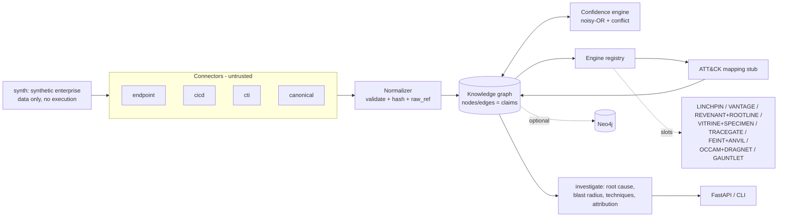

# THROUGHLINE — spine MVP

> One queryable, confidence-graded story of what happened, how it started, and what it affected.

THROUGHLINE is an open, graph-native, **evidence-first** security investigation platform. Every node and edge in its knowledge graph is a **claim** with a source, method, reliability grade, calibrated confidence and corroboration links. This repository holds only the **spine**, the shared contracts and components that the sibling portfolio projects plug into. It is deliberately not a speculative whole-platform build (see `../14-THROUGHLINE.md`, "Reality check").

## What is here

| Component | File | Status |
| --- | --- | --- |
| Frozen contracts (canonical event, node/edge schema, claim model) | `throughline/contracts.py` | done |
| Canonical event normalizer + SHA-256 integrity hashing (endpoint, cicd, cti, canonical connectors) | `throughline/normalizer.py` | done |
| Temporal knowledge graph with a claim model (networkx), root-cause chain, blast radius | `throughline/graph.py` | done |
| Confidence/evidence engine (method prior × source reliability, noisy-OR corroboration, conflict discount, Brier) | `throughline/confidence.py` | done |
| ATT&CK mapping stub (5 hand rules) | `throughline/attack.py` | stub |
| Synthetic-enterprise generator (labeled supply-chain intrusion, optional false flag) | `throughline/synth.py` | done |
| Pluggable engine interface + declared sibling slots | `throughline/modules.py` | interface |
| One-query investigation | `throughline/pipeline.py` | done |
| REST API (FastAPI, localhost) | `throughline/api.py` | done |
| Optional Neo4j mirror (parameterized Cypher) | `throughline/neo4j_adapter.py` | optional |
| CLI | `throughline/cli.py` | done |

## Architecture



Engines talk to each other **only through the graph and the frozen contracts** ([ADR-0001](docs/adr/0001-frozen-contracts.md)).

## Quickstart

```bash
pip install -r requirements.txt
make test          # or: python -m pytest -q
make demo          # or: python -m throughline demo
python -m throughline --false-flag demo            # attribution confidence drops
python -m throughline investigate checkout-7 --min-conf 0.5
python -m throughline explain c00032               # why this confidence?
python -m throughline export --format cypher       # Neo4j statements
python -m throughline engines                      # engine slots
python -m throughline serve                        # http://127.0.0.1:8000/docs
```

Demo output (abridged): *"What happened with checkout-7?"* returns the chain `Author:mallory -> Commit:deadbeef01 -> Dependency:colorama-utils==0.0.9 -> ImageLayer -> Pod:checkout-7`, the downstream `SPAWNED /bin/sh -> WROTE /tmp/.x -> CONNECTED_TO 203.0.113.66:443` activity, techniques T1195.001/T1059/T1105/T1071.001, and attribution `APT-Example: 0.75`, with claim ids cited for every fact. With `--false-flag`, a conflicting report pulls APT-Example down to about 0.51 and shows APT-Decoy at about 0.37.

## Prior art and how this differs

- **SIEM/XDR (Splunk, Elastic, Sentinel), CNAPP (Wiz)**: they correlate alerts, but they keep lifecycle layers in separate silos and treat confidence as an afterthought. THROUGHLINE puts code, build, runtime, network and intel into one graph and attaches provenance and confidence to every edge.
- **Provenance-graph research (DARPA TC, HOLMES, ATLAS)**: these cover host and system provenance only. THROUGHLINE extends the graph into CI/CD and CTI.
- **BloodHound**: covers the identity attack-path graph only. That slot belongs to the LINCHPIN engine here.
- **OpenCTI / MISP / STIX**: these offer intel graphs with confidence, but no runtime or code layers. THROUGHLINE borrows their reliability grading.
- **OCSF / ECS**: event normalization schemas. The canonical event here is intentionally tiny, and an OCSF mapper is a TODO.

The contribution is the combination: a unified, temporal, claim-based graph where every conclusion is inspectable and explainable (`/claims/{id}/explain`).

## Safety note

This is analytical software. The synthetic generator only emits **data**: nothing is executed or contacted, and every IP comes from the RFC 5737 documentation ranges. There is no offensive capability in this repo. Future simulation/emulation engines (GAUNTLET) must run only inside an isolated no-egress range behind an explicit lab-mode flag. See [SECURITY.md](SECURITY.md) and [THREAT_MODEL.md](THREAT_MODEL.md).

## Roadmap: where sibling projects plug in

| Engine slot (`modules.SIBLING_SLOTS`) | Sibling project | Reads | Writes | Grade |
| --- | --- | --- | --- | --- |
| attack-path | LINCHPIN | Host, Vulnerability, User | EXPLOITS | A/B |
| posture | VANTAGE | Control, Detection, Technique | SHOULD_DETECT, MITIGATES | A/B |
| provenance | REVENANT + ROOTLINE | Process, File | causal edges | B (eBPF: D) |
| malware | VITRINE + SPECIMEN | Sample | EXHIBITS, family | B/C |
| supply-chain | TRACEGATE | Commit, Dependency, Build | INTRODUCED, BUILT_INTO | A/B |
| detection | FEINT + ANVIL | events, Technique | Detection | B |
| intel | OCCAM + DRAGNET | IOC, Technique | ATTRIBUTED_TO (ACH) | B/C |
| simulation | GAUNTLET | Technique | labeled events | B/D |

To add an engine, implement `name`, `reads`, `writes` and `run(kg, context) -> list[Claim]`, then call `EngineRegistry.register`.

### TODO: deliberately skipped (Grade C/D/E)

- **C**: load the full MITRE ATT&CK STIX bundle; public datasets (DARPA TC, CIC-IDS, EMBER); an OCSF connector; a live CTI feed connector.
- **C/B**: event store (Parquet/OpenSearch), PostgreSQL custody ledger, MinIO evidence store, docker-compose stack.
- **D**: eBPF endpoint connector, isolated emulation range + egress enforcement, detection tuning, confidence-calibration judgment, Sigma rule authoring.
- **E / later stages**: agentic LLM investigator, the ANVIL feedback loop (learn, improve, validate), investigation console UI, benchmarks against a siloed baseline.
- Auth/RBAC on the API.
