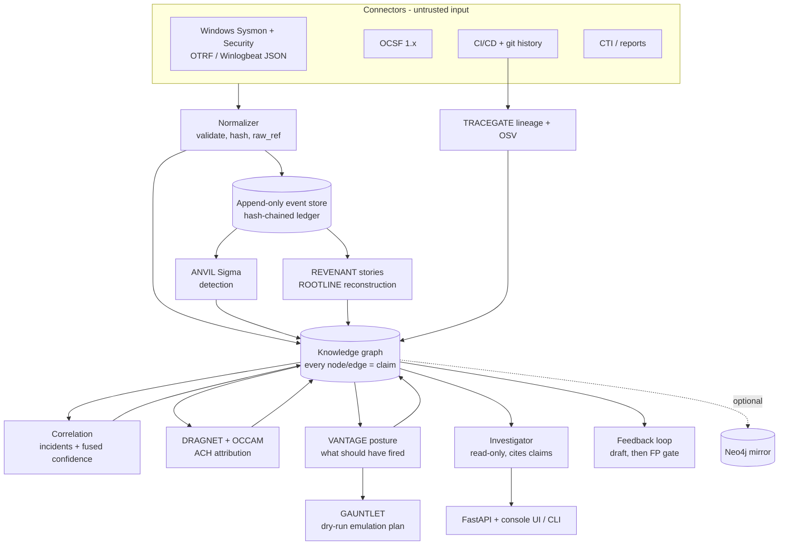
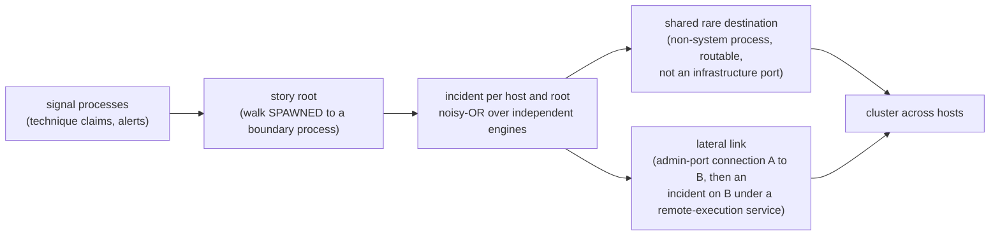

# Architecture

Engines talk to each other **only through the graph and the frozen contracts** ([ADR-0001](adr/0001-frozen-contracts.md), [ADR-0004](adr/0004-schema-0.2.md)). Order matters only because later engines read what earlier ones wrote.

### Engines

| slot | sibling (pinned release) | writes | exercised on |
| --- | --- | --- | --- |
| detection | [ANVIL](https://github.com/rakshit-737/anvil) `v1.1.0` | `Detection ALERTED_ON Process`, `Process EXHIBITS Technique` (Sigma level -> reliability grade) | real: 97 OTRF captures, APT29, APT3, LSASS campaigns |
| provenance | [REVENANT](https://github.com/rakshit-737/revenant) `v1.1.0` | technique tags from causal heuristics, `PART_OF` story incidents | real: same |
| provenance | [ROOTLINE](https://github.com/rakshit-737/rootline) `v1.1.0` | incident membership re-derived from its own provenance graph | real: APT29 (23 + 22 reconstructions), fixtures |
| intel | [DRAGNET](https://github.com/rakshit-737/dragnet) `v1.1.0` (`dragnet-attribution`) | one competing `Incident ATTRIBUTED_TO Actor` | real: ATT&CK campaigns, families and reports; APT29 |
| intel | [OCCAM](https://github.com/rakshit-737/occam) `v1.1.0` | one competing `ATTRIBUTED_TO`, `UNKNOWN` on false flags | real: same |
| posture | [VANTAGE](https://github.com/rakshit-737/vantage) `v1.1.0` | `Control MITIGATES`, `Detection SHOULD_DETECT`, detected / missed / blind per technique | real: ATT&CK + SigmaHQ + CIS v8 mapping |
| simulation | [GAUNTLET](https://github.com/rakshit-737/gauntlet) `v1.1.0` (`gauntlet-coverage`) | dry-run Atomic Red Team manifest for every missed technique | real gaps (APT29) |
| supply chain | [TRACEGATE](https://github.com/rakshit-737/tracegate) `v1.1.0` | `Author AUTHORED Commit INTRODUCED Dependency`, `Vulnerability AFFECTS Dependency` | real: healthchecks history + OSV |
| supply chain | [STRATUM](https://github.com/rakshit-737/stratum) `v1.1.0` | code -> build -> image -> workload -> pod lifecycle, Zero-Trust findings, incidents | STRATUM's synthetic cluster |
| attack path | [LINCHPIN](https://github.com/rakshit-737/linchpin) `v1.1.0` (`linchpin-attackpath`) | `CAN_REACH` hops, `Vulnerability AFFECTS Host`, ranked fixes | LINCHPIN's synthetic network |
| malware | [VITRINE](https://github.com/rakshit-737/vitrine) `v1.1.0` | `Sample EXHIBITS`, `ATTRIBUTED_TO MalwareFamily`, `Process USES Sample` by hash | inert synthetic samples |
| malware | [SPECIMEN](https://github.com/rakshit-737/specimen) `v1.1.0` | same, from a CAPE/Cuckoo report | report mapping (unit test) |
| network | [FEINT](https://github.com/rakshit-737/feint) `v1.0.0` (its newest release) | `Host CONNECTED_TO`, `EXHIBITS` for flows over threshold | flow mapping (unit test) |

The siblings are optional extras installed from those release tags ([ADR-0007](adr/0007-siblings-as-pinned-extras.md)); none of their code is vendored or modified. `throughline.engines.SIBLINGS` records the commit each tag pointed to when it was validated: CI fails if an installed sibling is not that commit, and `scripts/check_sibling_tags.py` (run again by the release workflow before anything is built) fails when a newer release exists, a pinned tag moved, or a newer release renamed its distribution. Without the siblings the core still runs the synthetic demo, and each missing engine is reported as skipped.

## The evidence model

Every node and edge is a **claim**: `(assertion, source, method, timestamp, confidence, corroboration[])`.
The source carries an Admiralty reliability grade (A-F); the method is observed, inferred, predicted or
stated-in-report; confidence rises with independent corroboration and falls with contradiction
([ADR-0003](adr/0003-confidence-model.md)). `GET /claims/{id}/explain` decomposes any confidence.

## Correlation and cross-host stitching

Two kinds of evidence join incidents on different hosts:

- **Shared rare destination.** Members of both incidents contacted the same remote endpoint. Connections made by operating-system processes (`lsass.exe`, `svchost.exe`, `backgroundtaskhost.exe`, ...) do not count, nor do loopback, link-local and multicast addresses, `localhost`, or Windows infrastructure ports (DNS, Kerberos, LDAP, RPC and its dynamic range, NetBIOS, SMB). A destination is rare if at most three incidents share it and at most half of the hosts (minimum two) contacted it at all, counted over all traffic.
- **Lateral movement.** A member on host A connected to host B on a remote-administration port (SMB, RPC, WinRM, RDP, SSH), and an incident on B starts under a remote-execution service (`psexesvc.exe`, `wsmprovhost.exe`, `wmiprvse.exe`, `winrshost.exe`) within an hour. Addresses map to hosts through the local address of each host's own outbound connections.

A cluster is a proposal with its evidence in `cluster_via` (for example `lateral scranton->nashua psexec64.exe 10.0.1.6:135`), not a proven edge. On the APT29 evaluation it joins exactly the evaluation's three lateral moves; the 1.0.0 rule (any destination shared by at most three incidents) had joined hosts through the domain controller, Azure endpoints and `localhost` ([Evaluation](evaluation.md#b4-apt29-evaluation-days-1-and-2)).

## Temporal views

Every claim carries its timestamp. `throughline.temporal.as_of(kg, ts)` keeps the first-order claims known at `ts` and recomputes confidence; `replay()` re-derives incidents on that view. The API's read endpoints take `as_of=`, and `throughline investigate --as-of` does the same on the command line, so an investigation can be replayed as it would have looked at any moment.
