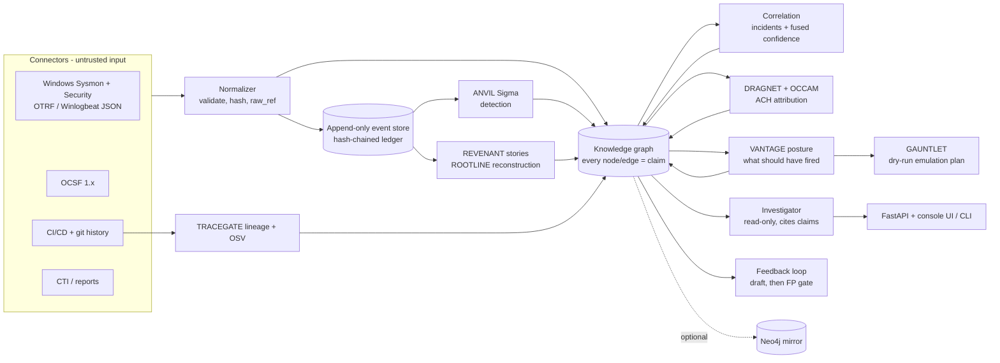
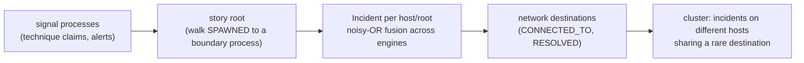

# Architecture

Engines talk to each other **only through the graph and the frozen contracts** ([ADR-0001](adr/0001-frozen-contracts.md), [ADR-0004](adr/0004-schema-0.2.md)). Order matters only because later engines read what earlier ones wrote.

### Engines

| slot | sibling (pinned tag / commit) | writes | exercised on |
| --- | --- | --- | --- |
| detection | [ANVIL](https://github.com/rakshit-737/anvil) `v1.0.0` | `Detection ALERTED_ON Process`, `Process EXHIBITS Technique` (Sigma level -> reliability grade) | real: 95 OTRF captures, APT29 |
| provenance | [REVENANT](https://github.com/rakshit-737/revenant) `4cbd2c3` | technique tags from causal heuristics, `PART_OF` story incidents | real: same |
| provenance | [ROOTLINE](https://github.com/rakshit-737/rootline) `v1.0.0` | incident membership re-derived from its own provenance graph | real: APT29 (23 reconstructions), fixtures |
| intel | [DRAGNET](https://github.com/rakshit-737/dragnet) `v1.0.0` | one competing `Incident ATTRIBUTED_TO Actor` | real: ATT&CK campaigns, APT29 |
| intel | [OCCAM](https://github.com/rakshit-737/occam) `v1.0.0` | one competing `ATTRIBUTED_TO`, `UNKNOWN` on false flags | real: same |
| posture | [VANTAGE](https://github.com/rakshit-737/vantage) `v1.0.0` | `Control MITIGATES`, `Detection SHOULD_DETECT`, detected / missed / blind per technique | real: ATT&CK + SigmaHQ + CIS v8 mapping |
| simulation | [GAUNTLET](https://github.com/rakshit-737/gauntlet) `v1.0.0` | dry-run Atomic Red Team manifest for every missed technique | real gaps (APT29: 4) |
| supply chain | [TRACEGATE](https://github.com/rakshit-737/tracegate) `v1.0.0` | `Author AUTHORED Commit INTRODUCED Dependency`, `Vulnerability AFFECTS Dependency` | real: healthchecks history + OSV |
| supply chain | [STRATUM](https://github.com/rakshit-737/stratum) `v1.0.0` | code -> build -> image -> workload -> pod lifecycle, Zero-Trust findings, incidents | STRATUM's synthetic cluster |
| attack path | [LINCHPIN](https://github.com/rakshit-737/linchpin) `v1.0.0` | `CAN_REACH` hops, `Vulnerability AFFECTS Host`, ranked fixes | LINCHPIN's synthetic network |
| malware | [VITRINE](https://github.com/rakshit-737/vitrine) `v1.0.0` | `Sample EXHIBITS`, `ATTRIBUTED_TO MalwareFamily`, `Process USES Sample` by hash | inert synthetic samples |
| malware | [SPECIMEN](https://github.com/rakshit-737/specimen) `v1.0.0` | same, from a CAPE/Cuckoo report | report mapping (unit test) |
| network | [FEINT](https://github.com/rakshit-737/feint) `v1.0.0` | `Host CONNECTED_TO`, `EXHIBITS` for flows over threshold | flow mapping (unit test) |

The siblings are optional extras installed from those commits ([ADR-0007](adr/0007-siblings-as-pinned-extras.md)); none of their code is vendored or modified. Without them the core still runs the synthetic demo, and each missing engine is reported as skipped.

## The evidence model

Every node and edge is a **claim**: `(assertion, source, method, timestamp, confidence, corroboration[])`.
The source carries an Admiralty reliability grade (A-F); the method is observed, inferred, predicted or
stated-in-report; confidence rises with independent corroboration and falls with contradiction
([ADR-0003](adr/0003-confidence-model.md)). `GET /claims/{id}/explain` decomposes any confidence.

## Correlation and cross-host stitching

Destinations shared by more than three incidents (domain controllers, proxies, update servers) are
treated as common infrastructure and ignored. A cluster is a proposal whose evidence is the shared
destination; it is not a proven lateral-movement edge.
