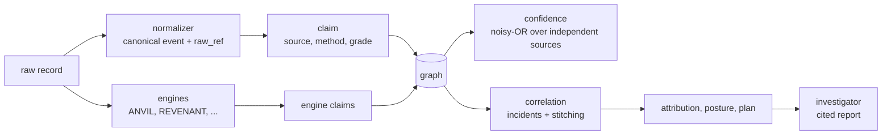

# How it works

This page follows one real investigation from raw event to cited answer: the committed OTRF capture **SDWIN-201018195009**, 184 Windows event records recorded while an operator dumped LSASS memory through `comsvcs.dll` (ATT&CK T1003.001). Every output below is what the code prints on that capture (`tests/fixtures/data`, no download needed):

```bash
pip install -e ".[engines]"
python -m throughline capture SDWIN-201018195009 --data tests/fixtures/data
```



## 1. A raw record becomes a canonical event and a claim

The Windows connector reads the record exactly as OTRF published it (Sysmon event 1, a process creation):

```json
{
 "Channel": "Microsoft-Windows-Sysmon/Operational", "EventID": 1, "Hostname": "WORKSTATION5",
 "UtcTime": "2020-10-18 23:50:05.910", "ProcessId": "4824",
 "Image": "C:\\Windows\\System32\\rundll32.exe",
 "CommandLine": "\"C:\\Windows\\System32\\rundll32.exe\" C:\\windows\\System32\\comsvcs.dll MiniDump 756 C:\\Users\\wardog\\AppData\\Local\\Temp\\lsass-comsvcs.dmp full",
 "ParentProcessId": "6100",
 "ParentImage": "C:\\Windows\\System32\\WindowsPowerShell\\v1.0\\powershell.exe"
}
```

The normalizer validates it against the frozen contracts, caps and cleans the fields, and hashes the raw record (`raw_ref`) so the claim can always be traced back to the bytes it came from:

```json
{
 "actor_type": "Process", "actor_id": "workstation5/6100/powershell.exe",
 "action": "SPAWNED",
 "object_type": "Process", "object_id": "workstation5/4824/rundll32.exe",
 "layer": "runtime", "source": "windows", "method": "observed", "reliability": "B",
 "ts": "2020-10-18T23:50:05.910Z",
 "raw_ref": "raw://windows/7f7afdb386588cb726a223a7ad06c8deb46faf627789000775f3c8a02ac1620c"
}
```

In the graph this is one **claim**: `Process:workstation5/6100/powershell.exe SPAWNED Process:workstation5/4824/rundll32.exe`. Its base confidence is the method prior times the source's Admiralty reliability weight: observed (0.9) x grade B (0.9) = **0.81** ([ADR-0003](adr/0003-confidence-model.md)). Raw records can also be kept in the append-only event store, whose hash-chained ledger `store verify` checks.

## 2. Engines add their own claims

Engines read the raw records or the graph and write only claims (the frozen engine protocol, [ADR-0001](adr/0001-frozen-contracts.md)):

- **ANVIL** matches its 2,410 compiled SigmaHQ Windows rules (the fixture carries five of them). Each hit is a `Detection ALERTED_ON Process` claim plus `Process EXHIBITS Technique` for each ATT&CK tag of the rule; the rule's level becomes the reliability grade (critical A ... informational E). Here 7 alerts fire on `rundll32.exe`.
- **REVENANT** builds its own provenance graph and scores events with ATT&CK heuristics; its tags are claims from a second, independent source (`revenant`), with the heuristic's weight as the engine's own score.
- **ROOTLINE** reconstructs incidents from a pivot, **DRAGNET** and **OCCAM** attribute them, **VANTAGE** checks what should have fired, **GAUNTLET** plans re-emulation of what was missed. On this capture ANVIL writes 21 claims, REVENANT 5, correlation 5, ROOTLINE 3, DRAGNET and OCCAM one each and VANTAGE 5 (GAUNTLET writes a dry-run plan, not claims); the graph holds 99 nodes and 190 claims.

## 3. Confidence: noisy-OR over independent sources

Several claims now support `Process:workstation5/4824/rundll32.exe EXHIBITS Technique:T1003.001`. The confidence engine takes the **best claim of each independent source** (twenty overlapping Sigma rules still count as one source, `anvil`) and combines them by noisy-OR, discounted by the strongest contradicting claim. `GET /claims/c00172/explain` (or a click in the console) shows the arithmetic:

```json
{
  "claim": "c00172",
  "assertion": "Process:workstation5/4824/rundll32.exe EXHIBITS Technique:T1003.001",
  "base": 0.6375,
  "method": "inferred",
  "reliability": "C",
  "independent_sources": ["anvil", "revenant"],
  "supporting": ["c00151", "c00159", "c00162", "c00165", "c00167", "c00173", "c00174"],
  "contradicting": [],
  "final": 0.8659,
  "rule": "noisy-OR over independent sources, discounted by strongest contradiction"
}
```

REVENANT's heuristic weight 0.85 x grade C (0.75) = 0.6375; ANVIL's best rule is 0.63; together 1 - (1 - 0.6375)(1 - 0.63) = **0.8659**. This independence rule is ablation A2 on the [Evaluation](evaluation.md#b1-technique-identification-and-the-ablation) page.


## 4. Correlation: incidents and fused technique confidence

Every process that carries a technique claim or an alert is a *signal*. Signals are grouped by their **story root**: walk `SPAWNED` parents until the parent is a session or service boundary process (`explorer.exe`, `services.exe`, `wmiprvse.exe`, ...). Here the root is `powershell.exe` (pid 6100), so the incident is `Incident:workstation5/6100/powershell.exe` with 3 member processes.

For each technique, the incident takes the best claim of each independent engine across all its members and combines them by noisy-OR: T1003.001 **0.87** (ANVIL + REVENANT), T1218.011 0.74, T1036 0.63. Those roll-ups are `Incident EXHIBITS Technique` claims that cite the member claims (they are not re-counted).

Incidents on different hosts are **stitched** into one cluster when they share a rare remote destination contacted by non-system processes (not a domain controller's Kerberos port, not `localhost`), or when an admin-port connection from host A is followed by an incident on host B that starts under a remote-execution service. On the APT29 evaluation this joins exactly the evaluation's lateral movement, e.g. `lateral scranton->nashua psexec64.exe 10.0.1.6:135`.

## 5. Calibration

Raw confidence is a good ranking score but not a probability: across 97 captures, raw fused confidence is over-confident (ECE 0.38). A Platt map fitted on those captures, `p = sigmoid(1.513 * logit(conf) - 2.264)`, ships in the package; incidents report both numbers. The 0.87 above becomes a calibrated **0.64**: on emulated-attack captures, about two in three technique claims that confident are the labelled technique (most of the rest are genuine but incidental behaviour).


## 6. Attribution with UNKNOWN as a hypothesis

DRAGNET and OCCAM each read the incident's techniques and the ATT&CK software tags of the rules that fired, and each writes **one** `Incident ATTRIBUTED_TO Actor` claim, or `Actor:UNKNOWN` when it abstains or suspects a false flag. `ATTRIBUTED_TO` is exclusive, so competing actors discount each other and agreement raises confidence ([ADR-0008](adr/0008-attribution-fusion.md)). Here both abstain: `UNKNOWN 0.49 [dragnet+occam]`. Three LSASS-dumping techniques are not enough evidence to name anyone, and the platform says so.

## 7. The investigator's cited report

The investigator is bounded, deterministic and read-only: a fixed sequence of graph queries, every finding citing claim ids.

```text
Investigation of Incident:workstation5/6100/powershell.exe (Incident:workstation5/6100/powershell.exe).
1. incident: 3 processes (2 by process lineage, 1 added by other engines) grouped under story root Process:workstation5/6100/powershell.exe; 7 alerts; strongest member Process:workstation5/4824/rundll32.exe [c00176, c00177, c00181]
2. techniques: T1003.001 OS Credential Dumping: LSASS Memory (0.87); T1218.011 System Binary Proxy Execution: Rundll32 (0.74); T1036 Masquerading (0.63) [c00178, c00180, c00179]
3. attribution: UNKNOWN 0.49 [dragnet+occam] [c00184]
4. posture: every observed technique had a detection fire
5. root_cause: C:\Windows\System32\WindowsPowerShell\v1.0\powershell.exe  -> "C:\Windows\System32\rundll32.exe" C:\windows\System32\comsvcs.dll MiniDump 756  [c00001, c00073]
6. corroboration: T1003.001 is supported by 2 independent engine(s): anvil, revenant [c00151, c00172]
7. blast_radius: 54 downstream entities: 1 File, 30 ModuleLoad, 2 Process, 21 RegistryKey
```

The same report is `GET /investigator/{entity}`; `as_of=` answers from the claims known at an earlier time.

## 8. When nothing fired: the feedback loop

If no engine claims the labelled technique, the capture is a detection gap. The loop keeps the command lines and script blocks that appear in no unrelated capture, asks ANVIL's drafter for Sigma rules, and accepts a draft only if it fires on its own capture and on zero events of every unrelated capture. Accepted drafts are re-validated in CI by re-running the benign behaviour they were mined from on a fresh Windows runner. They stay `status: experimental`, `reviewed: false`.
